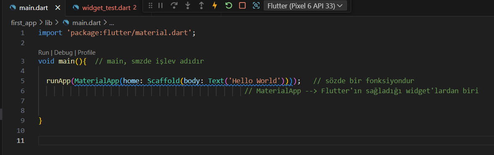
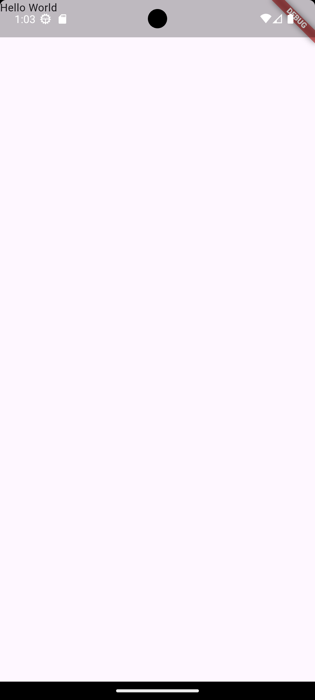
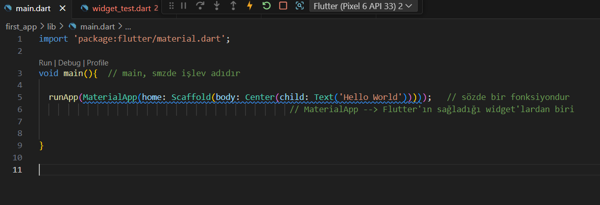
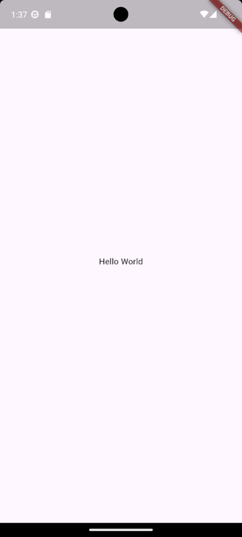

const: uygulamamızın çalışma zamanı performansını optimize etmesine yardımcı olmak için var olan bir anahtar kelime ve özelliktir

## Widget Tree

- Material App       **Root app that's rewuired by most other widgets**
  - Scaffold         **Screen layout widget tht adds base styling & more**
    - Row            **Widget that displays multiple adacent child widgets**
      - Text
      - Text
      - Text          **Widgets that display some text on the screen**

