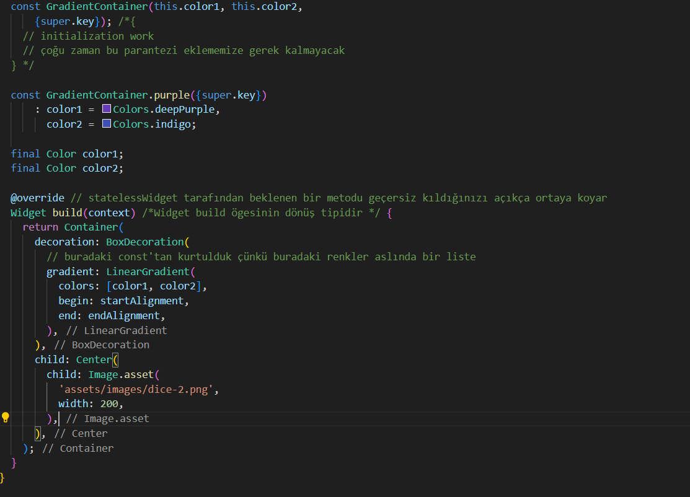
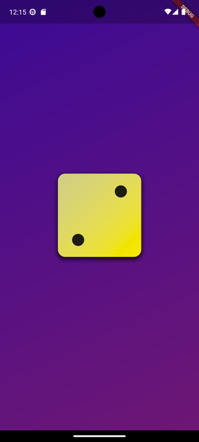
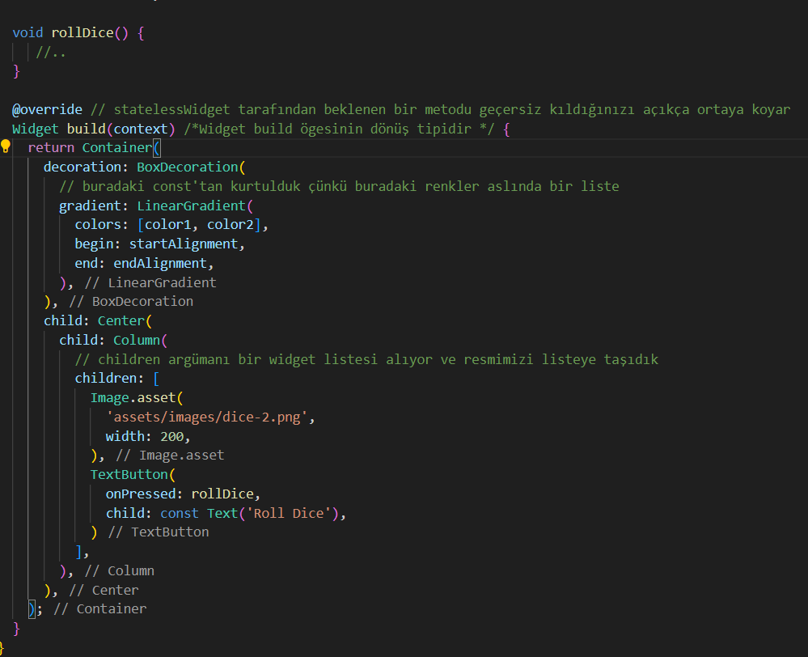
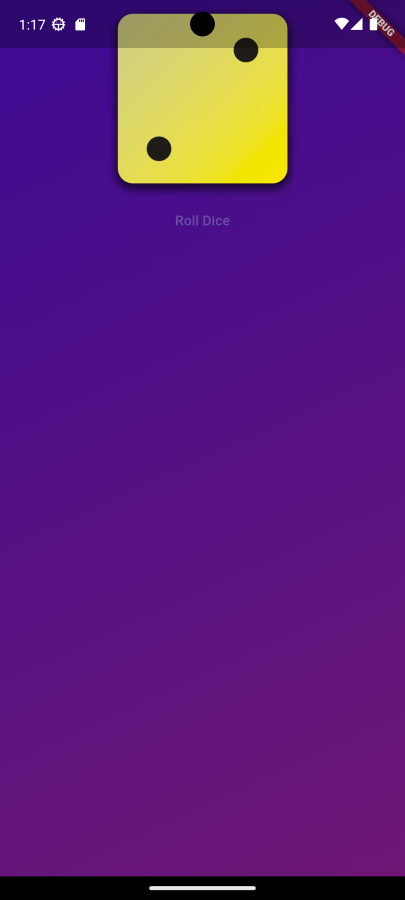
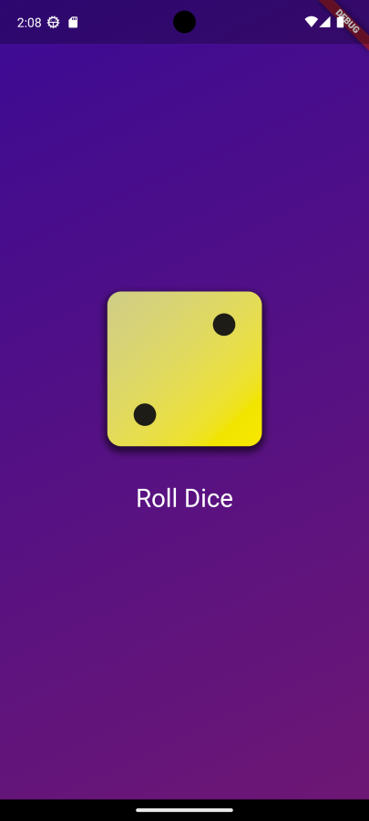
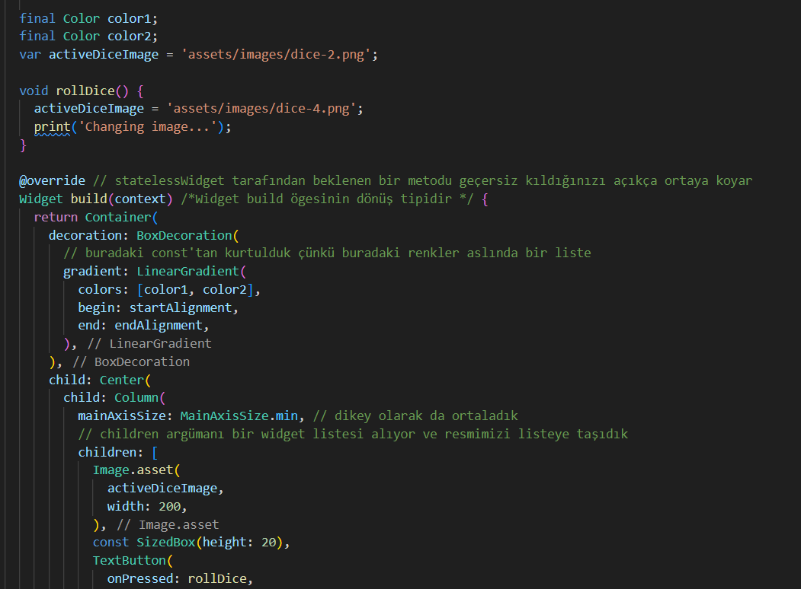
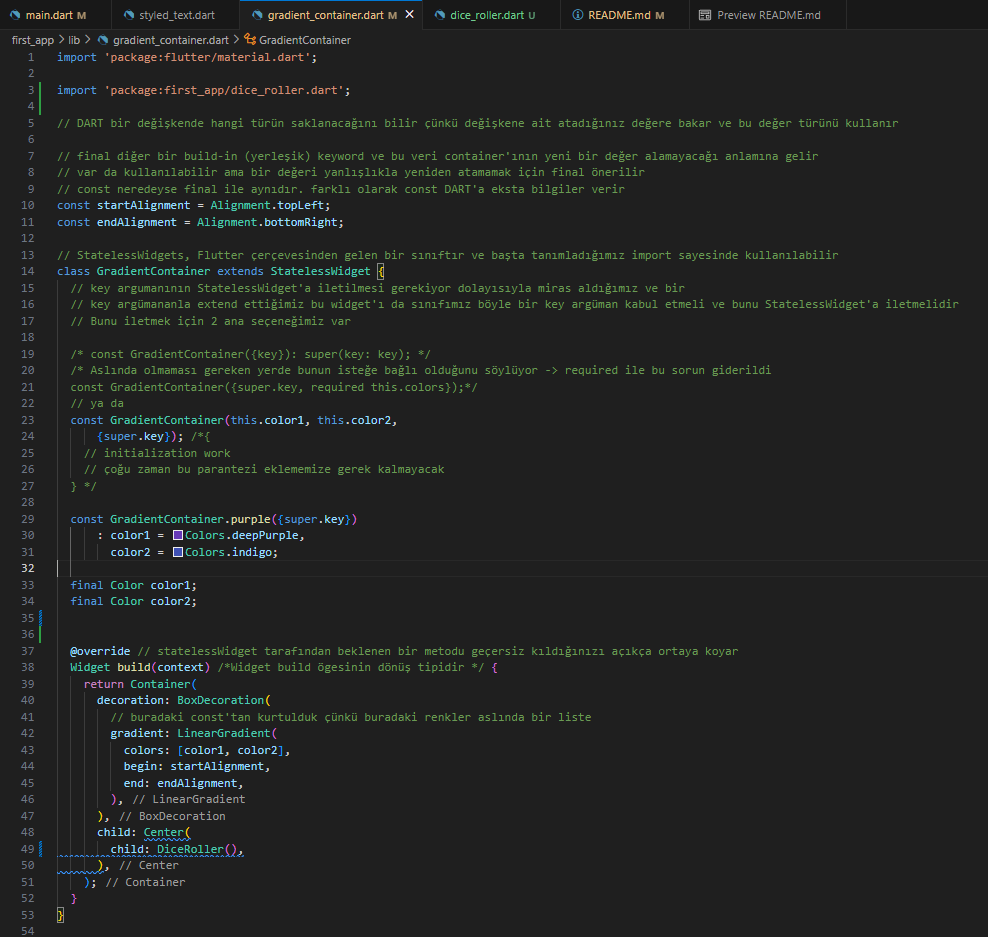
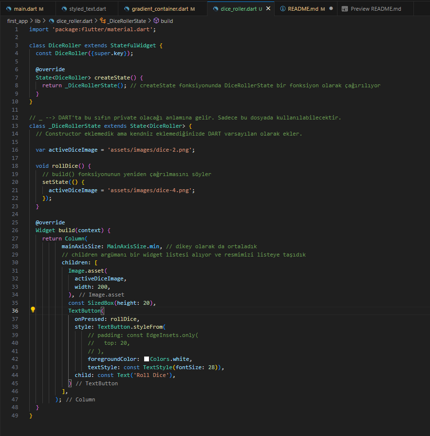
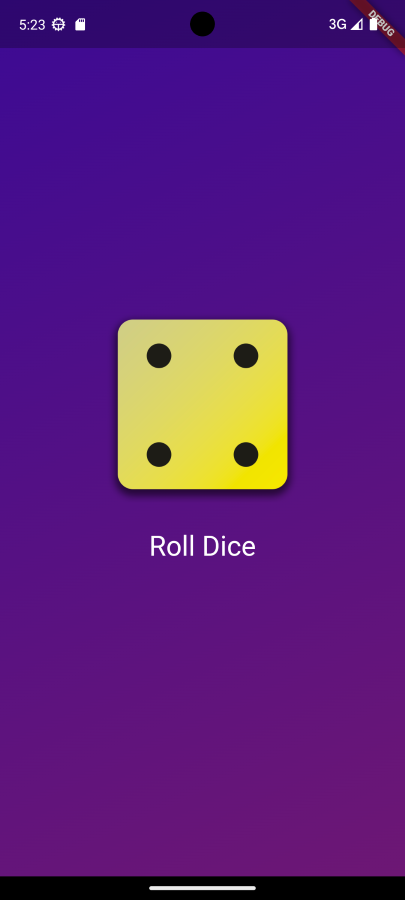
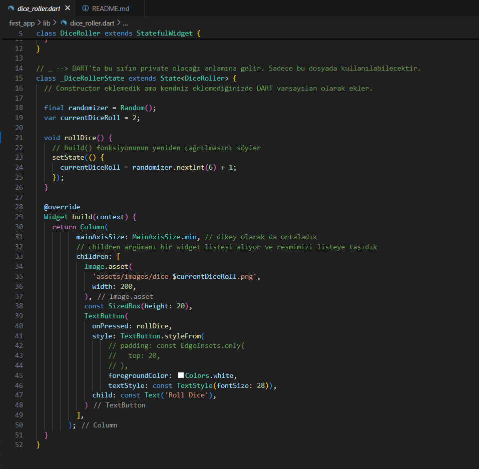

const: uygulamamızın çalışma zamanı performansını optimize etmesine yardımcı olmak için var olan bir anahtar kelime ve özelliktir


## Widget Tree

- Material App       **Root app that's rewuired by most other widgets**
  - Scaffold         **Screen layout widget tht adds base styling & more**
    - Row            **Widget that displays multiple adacent child widgets**
      - Text
      - Text
      - Text          **Widgets that display some text on the screen**


## Wrap with center


## Types

Dart is a type-safe languıage ---> All values are of certain Types

More than one Types is possible & common

##### 'Hello World!'  --- String Object
##### 29    ---  int num Object
##### MaterialApp --- MaterialApp Widget Object


### Widgets are Objects

Widgets = Objects = Data Structures in Memory

Widgets are objects and objects are simply these data strcutures in memory. Not just widgets are objects. All value types in the end are also objects


### Generic Types

Generic typs are "flexible types" that "work together" with other Types


## Understanding Classes

Dart is an object-orianted languages  
Every value is an object

|Primitive Values | More Complezx Values|
|-----------------|----------------------|
|Text|e.g., Widgets, Gradient Config Object|
|Numbers||

Objects are data structures stored in memory  
**Data** Variables / Priperties
**Functions** Methods  
objects help with organizing data and separating logic


## Working with Construction Functions

GradienContainer altındaki mavi çizgiler nereden geliyor?  
Public widget'lar için kurucuların adlandırılmış bir anahtar parametresi olması gerekir   

const helps Dart optimize runtime performance


## Splitting Code Across Files

lib klasörü içinde gradient_container.dart isimli dosya oluşturduk

main.dart  

gradient_container.dart  

styled_text.dart  


## Introducing Variables

Variables are "Data Containers"


## Instance Variables


'Hello World' burada sabit olarak kodlanmıştır. Bu nedenle, uygulamamızın herhangi bir yerinde stilize metin  
kullandığımızda her zaman Hello World çıktısı verecektir. Bu metin için bu yapılandırmayı tekrar kullanabilmek istiyoruz  
bu nedenle renk ve yazı tipi boyutu, ancak metnin kendisi dinamik olarak yerleştirilmelidir  
StyledText kullandığımız GradientContainer'da metni StyledText'e geçirebilseydik daha iyi olurdu. Böylece bu,  
özel widget'ımıza kilitlenmek yerine özel widget'ımızı kullanmak istediğimiz yerde hala ayarlanabilir   
  

Bu yaygın bir kullanımdır çünkü widget'larınızn çoğu yeniden kullanılabilir.   

Kendi widget'larımızı nasıl yeniden kullanılabilir hale detirebiliriz?  
Yapıcı fonksiyonun yardımıyla çünkü burara bier sınıf kullandığınızda kendi sınıfınız ya da Flutter tarafından sağlanan sınıf fark etmez, parantezler kullanarak onu bir nesneye dönüştürmeniz gerekir. Bu sınıfın kurucu işlevini çağırıyorsunuz  

Buraya virgül ekleyerek ve kabul etmek istediğimiz tüm adlandırılmış argümanları küme parantezleri arasına ekleyerek daha fazla adlandırılmış argüman kabul edebiliriz veya bu adlandırılmış argümanlara ek olarak bu küme parantezlerinden önce konumsal argümanlar da kabul edebiliriz  

  

Bu text'i burada kullanmıyoruz. Bunun yerine aşağıda hala sabit kodlanmış Hello World var. Peki bu text argümanını nasıl kullanabiliriz?  

  
ya da   
  


## Displaying Images & Using Multiple Constructor Functions 
Kodda görüntüleri kullanabilmek için pubspec.yaml dosyasına görüntüleri ekledik.  

  
  

## Adding Buttons and Using Functions As Values

Column widget, birden fazla widget'ı birbirinin üzerinde birden fazla alt öge olarak oluşturmanıza olanak sağlamak için vardır.  
Aynı işlemi yatay olarak yan yana yapacak bir Row widhet'ı da vardır.  
Zarın altına bir buton eklemek istiyoruz. Butonlar çok yaygın bir widget türüdür flutter üç farklı ana butonu destekler.  
  


```Flutter
// Arka plan rengine ve hafif bir gölgeye sahip bir düğmeyi görüntülemek için burada elevated button vardır.
ElevatedButton(onPressed: onPressed, child: child)
```

```Flutter
// Arka plan rengi olmayan ancak kenarlığı olan bir düğmeyi görüntülemek için outliner buton vardır.
OutlinedButton(onPressed: onPressed, child: child)
```

```Flutter
// Bir metin olan bir düğmeyi görüntülemek için text düğmesi vardır.
TextButton(onPressed: onPressed, child: child)
```

DART'taki fonksiyonlar da sadece nesnelerdir. Yani bir fonksiyon tanımlarsanız bir fonksiyonu değer olarak aktarabilirsiniz.

Onpressed için 2 seçeneğimiz var.  
Birinci seçenek fonksioyonu sadece yerinde tanımlarsınız.  
İkinci seçenek. bir method tanımlamanızdır. 
Methodun içine yazdığımız koda, bu butona bastığımızda ne yapmak istiyorsak onu yazabiliriz
  
  

## Styling Button & Working with Padding 

  
 

## How NOT To Build Interactive Widgets 

butona tıkladığımda zarda bir değişiklik olmuyor çünkü durum bilgisi olmayan bir widget'ın içindeyiz.  

 

## Introducing Stateful Widgets

Stateful widget'lar içlerindeki durumu yönetmemize izin verir. State ise basitçe zaman içinde değişebilen ve işlenen kullanıcı arayüzünü etkilemesi gereken verilerdir.  
Statedul widget kullanırken her zaman 2 class çalışacağız.

 
 
 

## Generating Random Numbers

 